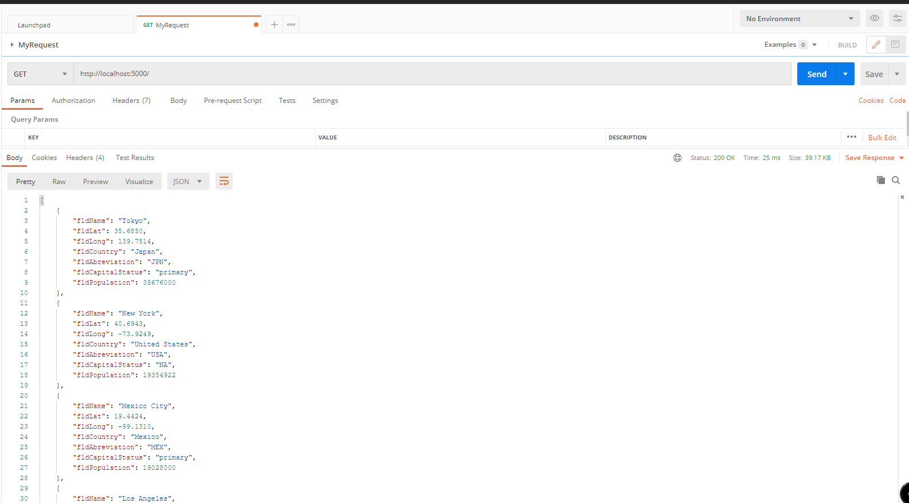
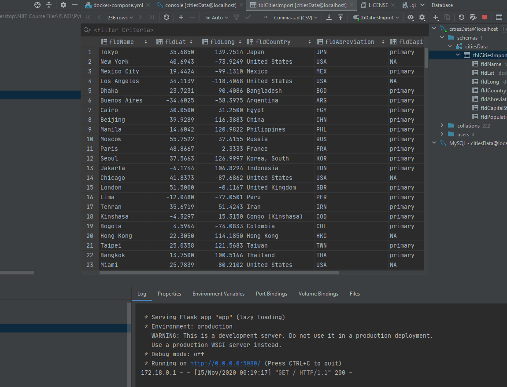

# Project Description
This project is a homework assignment 2 to teach how to get Pycharm setup with Docker, Flask, MySQL, and Postman

Note: This repository was initially cloned from Part 1 of this assignment which is located in this [Repository](https://github.com/Ericbrod10/PythonDockerFlaskPycharm)

# Postman Screenshot

# SQL Data Screenshot

